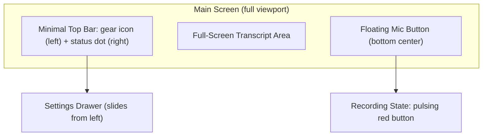

# Mobile-First ASR Redesign for Hard-of-Hearing Users

## Design Philosophy

Inspired by Jutukuva's viewer, the app should feel like a **full-screen reading surface with one big button**. Every pixel should serve the user's core task: seeing spoken words as large, readable text.

**Target users**: 40-50 year olds, primarily on phones, hard of hearing. They need:

- Huge touch targets (min 48px, ideally 56px+)
- High-contrast text with customizable colors
- Zero cognitive load -- one action visible at a time
- No visual clutter between them and the transcript

## New Layout Architecture

### Screen States

**1. Loading State** -- simplified from current `GreetingLoading`. Clean centered spinner with progress text, no "Welcome" card. Just the loading message on a clean background.

**2. Idle State (no transcript)** -- a gentle centered prompt: microphone icon + "Vajutage alustamiseks" / "Press to start". The big mic button at the bottom is the only actionable element.

**3. Active Recording** -- the mic button turns red and pulses. Transcript text flows in large readable paragraphs. A subtle recording indicator (red dot) appears in the top bar.

**4. Has Transcript** -- text fills the screen. Auto-scroll keeps the latest text visible. A scroll-to-bottom button appears if the user scrolls up. A "Clear" action is tucked into the settings drawer or accessible via long-press/secondary action.

### Component Changes

#### Remove

- [Navbar.tsx](app/components/header/Navbar.tsx) -- the entire HeroUI navbar with TalTech logo, start/stop/clear buttons
- [Footer.tsx](app/components/Footer.tsx) -- the footer with copyright, GitHub link, InfoDrawer
- The `StartSpeakingPrompt` bouncing arrow pattern -- replace with simpler prompt

#### Redesign

- **[Asr.tsx](app/components/Asr.tsx)** -- becomes the full-viewport container. Removes the `h-[calc(100vh-108px)]` hack (no navbar/footer to subtract). Uses `100dvh` for proper mobile viewport handling.
- **[CaptionDisplay.tsx](app/components/CaptionDisplay.tsx)** -- simplify the transcript blocks. Remove the per-block border/card styling. Render as clean flowing paragraphs (like Jutukuva's `SubtitleDisplay`). Keep copy-on-tap per block but make it more subtle. The text color and background come from settings (not hardcoded gray-800).
- **[Settings.jsx](app/components/header/Settings.jsx)** -- convert from HeroUI Modal to a **slide-out drawer from the left** (like Jutukuva). Restructure into clear sections:
  1. **Font size** -- larger range for mobile (16px-72px), slider with current value badge
  2. **Color presets** -- 6 preset cards (black-on-white, white-on-black, yellow-on-black, cyan-on-dark, amber-on-charcoal, blue-on-graphite) with "Aa" preview swatches
  3. **Language** -- simple ET/EN toggle
  4. **Advanced** -- collapsible section for Translation, Firebase, Zoom (hidden by default)
- **[GreetingLoading.tsx](app/components/GreetingLoading.tsx)** -- simplify to a full-screen overlay with just the progress bar and loading message. Remove the greeting card chrome.
- **[StartSpeakingPrompt.tsx](app/components/StartSpeakingPrompt.tsx)** -- replace with a minimal centered prompt (mic icon + one line of text). No bouncing arrow, no card.

#### Create

- `**FloatingMicButton` -- a large (64px), prominent circular button fixed to bottom center. States:
  - _Disabled_: gray, while model loads
  - _Ready_: blue/primary, "Alusta" label below
  - _Recording_: red with pulse animation, "Peata" label below
  - Tap toggles start/stop via existing `#startBtn`/`#stopBtn` mechanism
  - Includes a small "Clear" button that appears next to it when there's transcript text
- `**TopBar` -- ultra-minimal bar (not a navbar): gear icon on the left, optional recording indicator (red dot) in center, and a small status element on the right. Semi-transparent, overlays the transcript.
- `**SettingsDrawer` -- slide-out panel from the left with:
  - Font size slider
  - Color presets grid
  - Language toggle
  - Collapsible "Advanced" section
  - App info / credits (replaces Footer + InfoDrawer)
  - Backdrop click to close
  - ARIA dialog attributes

#### Update

- **[SettingsContext.jsx](app/providers/SettingsContext.jsx)** -- add `textColor` and `backgroundColor` settings (currently hardcoded). Default to white-on-black. Update the storage key to `settings:v2`.
- **[globals.css](app/globals.css)** -- add CSS custom properties for theme colors. Add safe-area-inset padding for notched phones. Add smooth transitions for color/background changes.
- **[page.tsx](app/page.tsx)** -- remove `<Navbar />` and `<Footer />` from the layout. Just render `<Asr />` (which now contains everything).

### Accessibility

- `aria-live="polite"` on transcript region (like Jutukuva)
- `role="main"` on transcript area
- `role="dialog"` and `aria-modal="true"` on settings drawer
- `aria-pressed` on toggle buttons
- `focus-visible` outlines on interactive elements
- Touch-friendly: `env(safe-area-inset-*)` for notched devices

### Color Presets (from Jutukuva, adapted)

| Preset            | Text    | Background |
| ----------------- | ------- | ---------- |
| Black on White    | #000000 | #FFFFFF    |
| White on Black    | #FFFFFF | #000000    |
| Yellow on Black   | #F8E71C | #000000    |
| Cyan on Dark      | #50E3C2 | #0B0B0B    |
| Amber on Charcoal | #FFB347 | #1A1A1A    |
| Blue on Graphite  | #E0F0FF | #0F1216    |

Default: **White on Black** (current app default, familiar to users).

### Mobile-Specific Considerations

- Use `100dvh` instead of `100vh` for correct mobile viewport
- `overscroll-behavior-y: contain` to prevent pull-to-refresh interference
- `env(safe-area-inset-bottom)` padding for the floating mic button
- Touch targets minimum 48x48px, mic button 64x64px
- No hover-dependent interactions
- `user-select: none` on controls, `user-select: text` on transcript
